# ImageTagger
ImageTagger: A collection of image tagging methods.
## Install
```
git clone https://github.com/RobertLau666/ImageTagger.git

conda create -n imagetagger python=3.10
conda activate imagetagger
pip install --upgrade pip

cd ImageTagger/models/LLaVA_NeXT
pip install -e ".[train]"

cd ../..
pip install -r requirements.txt
```
## Run
```
bash app.sh
```
## Result
| image | caption |
|------|-----------|
| 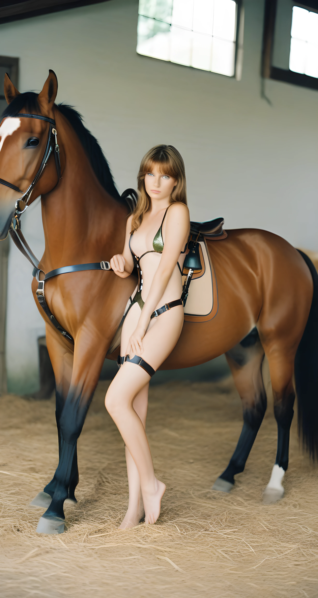 | <pre style="width: 400px; overflow-x: auto; white-space: nowrap;"><code>"wd_tagger": "1girl, horse, swimsuit, bikini, brown hair, long hair, barefoot, holster, weapon, gun, solo, breasts, saddle, thigh strap, looking at viewer, indoors, animal, thigh holster, reins",<br>"joy_tag": "1girl, solo, long_hair, breasts, looking_at_viewer, blonde_hair, brown_hair, brown_eyes, medium_breasts, nipples, swimsuit, bikini, barefoot, indoors, legs, animal, photo_(medium), riding, horse, bestiality, floor, horseback_riding",<br>"llama_joycaption_alphatwo": "This photograph features a young, slender Caucasian woman with fair skin and shoulder-length, light brown hair, standing in an indoor equestrian setting. She is dressed scantily in a revealing harness that accentuates and covers her breasts, nipples, and crotch minimally. Her accessories include a black garter on her left thigh. She stands with one arm resting on a beautifully polished chestnut-colored stallion, who has a well-muscled build with a glossy coat and a mane that blends dark and light brown tones. The horse wears a black leather bridle, reins, and a padded saddle with a white, brown, and black pattern. The background shows a typical barn environment; light-colored walls with visible grime, a partially blocked window with daylight filtering through, and a partially visible door leading outside. The floor is covered in dry straw, typical of a stable or riding arena. The image has a realistic, lifelike photographic style with a high degree of detail, emphasizing the close interaction and connection between the woman and the horse. The textures of fur, leather, and her skin are clearly visible, adding to the overall realism of the scene.",<br>"llava_next": "The image shows a person wearing a bikini or lingerie, standing next to a horse. The person is holding the reins of the horse and appears to be posing for the photo. The setting looks like a stable or a similar environment where horses are kept. The horse is a large, brown animal with a saddle on its back, suggesting it might be used for riding. The lighting and composition of the photo give it a warm and intimate feel.",</code></pre> |
| 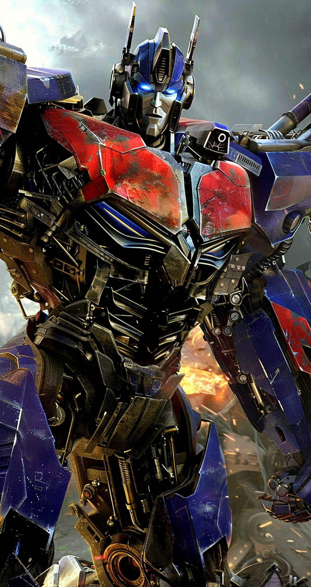 | <pre style="width: 400px; overflow-x: auto; white-space: nowrap;"><code>"wd_tagger": "robot, mecha, glowing eyes, blue eyes, autobot, glowing, no humans, science fiction, looking at viewer, weapon, clenched hand, 1boy, solo, damaged",<br>"joy_tag": "solo, looking_at_viewer, blue_eyes, photoshop_(medium), 1boy, official_art, no_humans, glowing, traditional_media, clenched_hand, mecha, glowing_eyes, science_fiction, realistic, robot, retro_artstyle, dirty, damaged, 1980s_(style), transformers, debris, insignia, autobot",<br>"llama_joycaption_alphatwo": "The image is a highly detailed CGI rendering of a transforming robot, specifically Bumblebee from the Transformers franchise. The robot is depicted in its combat mode, showcasing intricate mechanical details with a metallic texture and a weathered, battle-worn appearance. Its body is predominantly blue, adorned with vibrant red highlights on the chest, which glows with an intense, fiery light effect, adding a dynamic and dramatic feel to the scene. The eyes are a bright, luminous blue, which contrasts sharply with the dark, grey sky in the background of dark clouds.The robot stands in a dynamic and powerful pose, leaning slightly forward with its arms ready for action. The background is a blurred landscape with hints of what seems to be fire and debris, adding to the sense of battle or destruction. The foreground is filled with various mechanical components and armor plating, contributing to the robotic, militaristic theme.Additionally, the image features a watermark in the bottom right corner that reads "CGI ARTISTS PUBLICATION AND DISTRIBUTION LLC." Overall, the image's realism, detail, and dramatic lighting evoke a sense of heroic action and advanced, futuristic technology.",<br>"llava_next": "The image shows a robot or mecha character, which appears to be from a science fiction setting. It has a humanoid form with a predominantly blue and red color scheme, and it's equipped with various mechanical parts and weapons. The design suggests it could be from a video game, movie, or a similar media franchise. The background is somewhat blurred, but it looks like a dramatic, possibly battle-related scene with a cloudy sky and what might be explosions or energy effects.",</code></pre> |
| 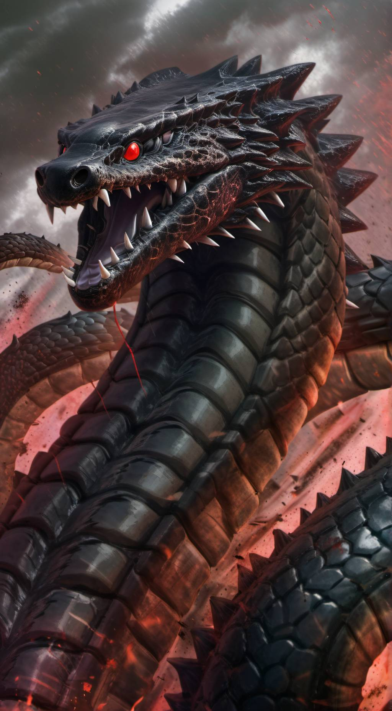 | <pre style="width: 400px; overflow-x: auto; white-space: nowrap;"><code>"wd_tagger": "no humans, red eyes, open mouth, sharp teeth, teeth, scales, glowing, glowing eyes, monster, tail, fangs, kaijuu, solo, sky, spikes",<br>"joy_tag": "solo, open_mouth, photoshop_(medium), red_eyes, tail, horns, teeth, no_humans, animal, fangs, fire, sharp_teeth, claws, spikes, smoke, monster, dragon_horns, snake, dragon, dragon_tail, scales, monster_hunter_(series), turtle, eastern_dragon",<br>"llama_joycaption_alphatwo": "This is a highly detailed, digital CGI rendering depicting a terrifying, menacing dragon. The dragon's textured, scaly body is predominantly olive green with a dark, almost black hue, giving it an intimidating, sinister look. The image captures the dragon from a low, upward angle, creating an imposing perspective where its fearsome expression and sharp teeth dominate the frame.The dragon's eyes are intense, vividly glowing red, adding to the ferocity of its gaze. Sharp, jagged teeth are visible, bared in a menacing snarl. Its scales are meticulously detailed, showing varying textures and shades, and some even appear serrated, enhancing its formidable appearance.From its head emerge multiple spiky protrusions, contributing to its hostile demeanor. The background features a dark, stormy sky with streaks of fiery red and orange, suggesting an approaching storm or volcanic activity, which matches the dragon's menacing aura. Light effects are used adeptly to suggest depth and motion, with glimmers highlighting parts of its scales and shadows accentuating the contours of its body.This CGI piece exemplifies a blend of realism and fantasy, perfect for fans of fantasy and mythical creatures, with a strong emphasis on texture, light, and dramatic atmosphere.",<br>"llava_next": "The image depicts a highly stylized and fantastical creature that resembles a dragon. It has a large, serpentine body with scales, a prominent head with sharp teeth, and a fiery red eye. The dragon is surrounded by a dramatic, fiery environment with what appears to be flames and smoke, suggesting a scene of power and intensity. The artwork is detailed and vivid, with a focus on the creature's menacing appearance.",</code></pre> |
| 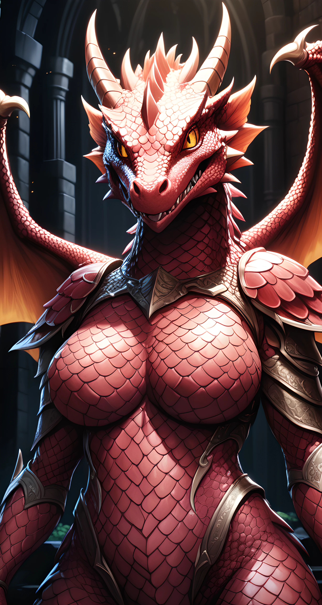 | <pre style="width: 400px; overflow-x: auto; white-space: nowrap;"><code>"wd_tagger": "breasts, 1girl, horns, scales, large breasts, solo, wings, colored skin, looking at viewer, red skin, teeth, dragon horns, slit pupils, dragon girl, yellow eyes, colored sclera, dragon wings, sharp teeth, armor, furry, black sclera, fishnets, dragon, no nipples",<br>"joy_tag": "1girl, solo, breasts, looking_at_viewer, open_mouth, large_breasts, navel, tail, yellow_eyes, upper_body, wings, horns, teeth, armor, orange_eyes, colored_skin, fangs, monster_girl, slit_pupils, sharp_teeth, claws, colored_sclera, dragon_horns, dragon_girl, dragon, dragon_tail, black_sclera, scales, monster_hunter_(series), red_skin, red_wings, yellow_sclera, dragon_wings",<br>"llama_joycaption_alphatwo": "This is a highly detailed, CGI rendering of a fierce, humanoid dragon characterized with distinctly feminine features. The creature stands in the forefront against a muted, gothic-style background composed of dark, arched stone columns that recede into obscurity, suggesting a fantasy setting such as a castle or cathedral. The dragon's skin is a vibrant red, covered in scales that glint in the low illumination like polished armor.This dragon possesses a pronounced, muscular physique with large, shapely breasts, indicating a female gender. Her face is adorned with sharp, yellow eyes that emit a glowing red light with vertical, slit pupils, conveying sharp intelligence and ferocity. Multiple horns protrude from her head, adding to her menacing appearance, and the tips of her ears are tipped with small, angular spikes.The dragon's wings are partially spread out, showcasing yellow, bat-like membranes under a tough outer layer, similar in texture to the rest of her scales but slightly more translucent. She wears medieval-style metal armor that clings closely to her form, emphasizing her broad chest and strong shoulders, with a high collar that suggests a regal, authoritative figure. Despite her fearsome appearance, the detailing in her body suggests a balance of strength and femininity.",<br>"llava_next": "The image shows a fantasy character that appears to be a blend of a human and a dragon. The character has a humanoid body with a prominent chest and a dragon's head, complete with horns and a fiery mane. The character is wearing armor, suggesting a warrior or guardian role, and is set against a backdrop that looks like a dark, possibly underground or ancient, environment with architectural features that could be part of a castle or ruins. The artwork is detailed and vibrant, with a focus on the character's design and the dramatic lighting.",</code></pre> |
| 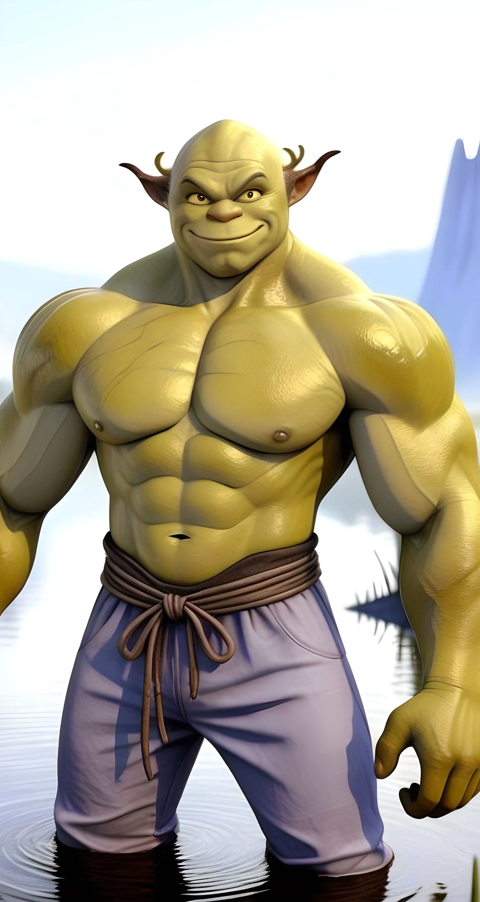 | <pre style="width: 400px; overflow-x: auto; white-space: nowrap;"><code>"wd_tagger": "1boy, male focus, solo, muscular, muscular male, topless male, pectorals, colored skin, abs, nipples, large pectorals, bara, water, looking at viewer, navel, smile, green skin, pants, wading, pointy ears",<br>"joy_tag": "solo, looking_at_viewer, smile, 1boy, navel, nipples, standing, male_focus, outdoors, horns, day, pointy_ears, pants, water, stomach, muscular, colored_skin, feet_out_of_frame, abs, thick_eyebrows, pectorals, muscular_male, bara, wading, large_pectorals, topless_male, veins, bald, head_fins, green_skin, monster_boy, alien, tusks, warcraft",<br>"llama_joycaption_alphatwo": "This is a digital CGI illustration featuring a highly realistic rendering of an anthropomorphic orc standing in shallow water. The orc has an extremely muscular physique with well-defined abs, pectorals, and biceps, giving a highly detailed texture to his light green, almost yellow skin. His face is round with a broad nose, and he has a sly, confident smile. His pointed ears, which are a darker shade that protrude from the sides of his head, and the two elongated, curved horns on his forehead are distinctly orc-like traits. He is depicted wearing slightly baggy, light blue or lavender-colored sweatpants that are cinched at the waist with a thick brown rope, contrasting against the smoothness of his skin. The water around his feet is rendered with careful attention to ripples and reflections, indicating a calm setting. The background, slightly out of focus, displays a serene blue sky and gently sloping hills, adding to the tranquil and scenic ambiance of the image. The lighting is soft yet highlights the orc's musculature, suggesting a sunny day. This combination of anthropomorphism and realism creates a visually striking and detailed character in a natural outdoor environment.",<br>"llava_next": "The image shows a 3D rendering of a character that appears to be a muscular, green-skinned creature with pointed ears, resembling a fantasy or mythical being. The character is wearing blue shorts with a brown belt and is standing in a body of water, possibly a lake or river, with a mountain in the background. The character is smiling and seems to be in a relaxed or happy mood. The style of the image suggests it could be from a video game, animation, or a concept for a character design.",</code></pre> |
| 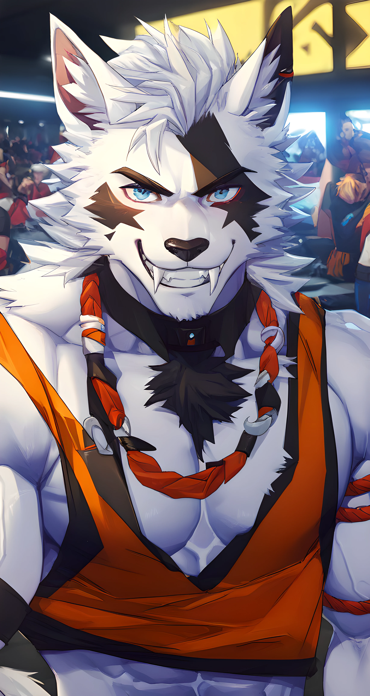 | <pre style="width: 400px; overflow-x: auto; white-space: nowrap;"><code>"wd_tagger": "male focus, furry, furry male, bara, pectorals, animal ears, pectoral cleavage, muscular, muscular male, 1boy, blue eyes, wolf boy, looking at viewer, fangs, wolf ears, large pectorals, smile, white hair, tank top, upper body, abs, solo focus, thick eyebrows, white fur, collar, multiple boys, sidepec",<br>"joy_tag": "solo, looking_at_viewer, smile, short_hair, blue_eyes, 1boy, animal_ears, bare_shoulders, tail, upper_body, male_focus, sleeveless, solo_focus, grin, medium_hair, stomach, collar, muscular, facial_hair, fangs, abs, wolf_ears, tank_top, pectorals, muscular_male, dog_ears, wolf_tail, bara, furry, large_pectorals, dog_tail, mature_male, goatee, furry_male, tiger_ears, orange_shirt, chest_hair, pectoral_cleavage, white_fur, black_tank_top, brown_fur, forked_eyebrows, two-tone_fur",<br>"llama_joycaption_alphatwo": "The image is a digitally rendered, anime-inspired illustration of an anthropomorphic wolf with a muscular build. The wolf character is predominantly white with gray and black markings. Its fur is detailed, giving a fluffy texture to the image, especially around the chest area. The wolf's eyes are strikingly blue and narrowed, giving an expression of intensity or focus. Its teeth are sharp and partially visible, making its face appear fierce amidst its otherwise attractive features.The wolf is wearing a vibrant orange sleeveless tank top that showcases its muscular torso and abs. A double-stranded, red hair-like accessory is draped around its neck, with one strand tucked behind the character's ear and the other wrapped around its upper arm. The background features a crowd of spectators in colorful attire, suggesting the setting is a sports event, such as a wrestling match. The audience includes anthropomorphic characters, all with detailed fur and facial expressions, adding to the dynamic atmosphere of the illustration. The lighting is bright and reflects off the glossy fur, making the colors pop. The overall composition is dynamic and energetic, showcasing the fierce and powerful presence of the wolf character amid a lively crowd.",<br>"llava_next": "The image shows an anthropomorphic character, which is a creature with both human and animal characteristics. This character has the body of a human and the head of a wolf, with white fur and distinctive markings around the eyes and muzzle. The character is wearing an orange and black outfit with a choker, and there are other people in the background, suggesting this might be from a video game or a similar digital environment. The character is also wearing a necklace with a pendant.",</code></pre> |
| 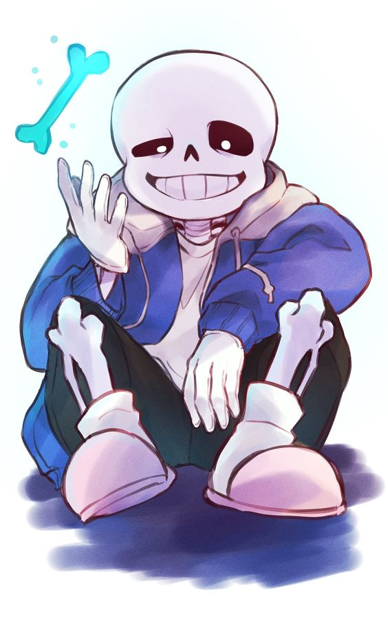 | <pre style="width: 400px; overflow-x: auto; white-space: nowrap;"><code>"wd_tagger": "1boy, skeleton, solo, male focus, bone, hood, smile, hoodie, slippers, sitting, white background, shirt, grin, jacket, looking at viewer, blue jacket, simple background, white shirt, shorts, gloves, open clothes, full body, hood down, teeth, pants",<br>"joy_tag": "solo, looking_at_viewer, smile, simple_background, shirt, gloves, white_background, 1boy, long_sleeves, sitting, jacket, male_focus, shorts, teeth, hood, black_eyes, grin, hoodie, glowing, skull, pink_footwear, slippers, glowing_eye, skeleton, bone, undertale",<br>"llama_joycaption_alphatwo": "This digital drawing features a character from the popular video game "Undertale" named Sans. He is drawn in a stylized cartoon manner, with bold outlines and vibrant colors. The character has white skin, a skull-like face with empty, black eye sockets, and a wide, inviting grin with a single visible tooth. Sans wears a loose, open blue hoodie with a white T-shirt peeking underneath, and black sweatpants. His oversized, floppy shoes are pink. He is seated cross-legged with his left hand visible near his face, raised as if waving, while the other hand rests on his knee.Floating in front of his waving hand, there is a floating blue bone. The background is mostly white and light blue, with no additional objects or scenery. The art style is playful and animated, capturing the whimsical, charming nature of the "Undertale" series, and is highly polished with a smooth, glossy texture.",<br>"llava_next": "The image shows an animated character that appears to be a skeleton with a friendly expression. The character has a large head with two eyes and a mouth, and it's holding a blue bone in its right hand. It's wearing a blue jacket over a white shirt and has white gloves. The character is also wearing white shoes with pink soles. The background is plain and does not provide any additional context. The style of the drawing is cartoonish and colorful, with a focus on the character's cheerful demeanor.",</code></pre> |
| 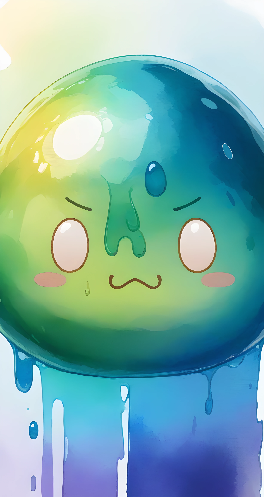 | <pre style="width: 400px; overflow-x: auto; white-space: nowrap;"><code>"wd_tagger": "slime \(creature\), :3, no humans, blush stickers, solo, slime \(substance\), closed mouth, o_o, looking at viewer",<br>"joy_tag": "solo, looking_at_viewer, closed_mouth, no_humans, :3, blush_stickers, 0_0, white_eyes, blank_eyes, slime_(substance), slime_girl, melting",<br>"llama_joycaption_alphatwo": "The image is a digital drawing in a watercolor style that features a vibrant, translucent slime-like creature. The creature has a round, shiny head that hovers in mid-air, creating an impression of being in liquid. The slime head is predominantly green with gradient hues that transition into a purplish color at the bottom.Its eyes are large, round, and bright white with black pupils. They emit an innocent and curious expression, enhanced by its small, brown, arched eyebrows and a tiny frown line above them, indicating a somewhat distressed expression. The creature has a small, pinkish blush mark on either side of its cheeks. Tiny droplets of water cling to its smooth surface, suggesting it's either wet or it's the natural texture of the material.Behind the slime figure, the background features a gradient wash of pastel blue and white, giving a soft, almost whimsical feel that complements the overall light and airy atmosphere of the image. The creature appears to be made of a gooey, soft texture, with the transparent look creating a sense of fluidity and ease.Overall, the artwork exudes a playful, fantastical charm through its simple yet expressive style and vibrant colors.",<br>"llava_next": "The image shows a stylized, cartoonish depiction of a jellyfish. It has a large, round body with a translucent blue-green hue, and it appears to be floating in a light blue background with some white speckles that could represent bubbles or stars. The jellyfish has two small, simple eyes and a small, smiling mouth, giving it a friendly and approachable appearance. The overall style is cute and whimsical, likely intended to appeal to a younger audience or to be used as a character in a children's story or animation.",</code></pre> |
| 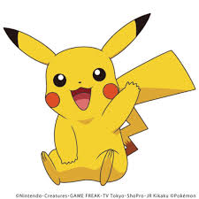 | <pre style="width: 400px; overflow-x: auto; white-space: nowrap;"><code>"wd_tagger": "pokemon \(creature\), no humans, solo, open mouth, simple background, full body, white background, sitting, smile, :d, looking at viewer, web address, black eyes, watermark, happy, :3",<br>"joy_tag": "solo, tail, pokemon, no_humans, pokemon_(creature), :3, jpeg_artifacts, pikachu",<br>"llama_joycaption_alphatwo": "This image is a digital drawing of Pikachu, a well-known fictional creature from the Pokémon franchise. It is depicted in a classic, cheerful pose with an open mouth, suggesting it is either speaking or laughing. Pikachu's body is bright yellow and covered in short, fine fur, characterized by its signature lightning bolt-shaped tail that curves slightly upwards with a brown tip. The creature is perched with its body facing forward, its left leg is up and to the right, while the right leg is extended downward and slightly forward.On its face, Pikachu has two large, black eyes with white highlights, giving it an expressive, alert appearance. Two prominent red cheeks are situated close to the top on each side of its face, providing contrast to the yellow body. The inner part of its ears is dark brown, and the insides are pointed upwards, with black tips at the end. Pikachu's mouth shows small, sharp teeth and its tongue is extended outward.The overall style of the drawing is clean and vibrant, with smooth lines and bold colors typical of contemporary animated character art. There is no detailed background as the image focuses solely on Pikachu, set against a plain white backdrop, emphasizing the character's iconic look.",<br>"llava_next": "The image shows an animated character, Pikachu, which is a popular Pokémon from the Pokémon franchise. Pikachu is depicted in a cute and friendly pose, with its arms raised and a big smile on its face, giving the impression of happiness or excitement. The character is known for its yellow color, lightning bolt-shaped mark on its cheeks, and the electric-type moves it can perform.",</code></pre> |
| 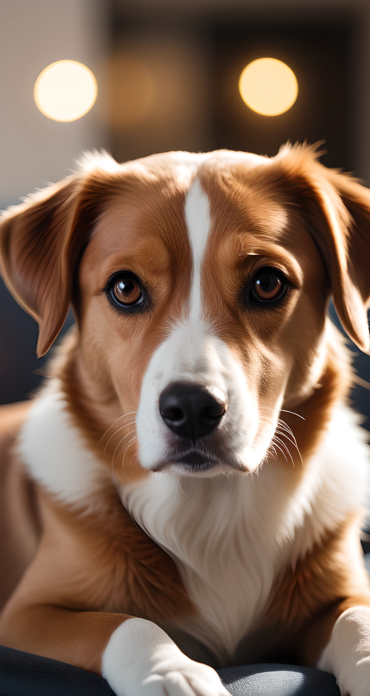 | <pre style="width: 400px; overflow-x: auto; white-space: nowrap;"><code>"wd_tagger": "dog, no humans, realistic, animal focus, looking at viewer, brown eyes, animal, blurry, photorealistic, blurry background, shiba inu",<br>"joy_tag": "solo, looking_at_viewer, photoshop_(medium), gloves, original, brown_eyes, animal_ears, tail, white_gloves, indoors, black_eyes, blurry, no_humans, depth_of_field, animal, blurry_background, cat, dog_ears, close-up, dog, animal_hands, realistic, animal_focus, white_fur, whiskers, animal_nose, brown_fur, two-tone_fur",<br>"llama_joycaption_alphatwo": "This is a digital illustration of a cute, medium-sized mixed-breed puppy with a distinctive markings and an expressive face. The dog has a tan-colored coat with a white blaze down the center of its face from nose to forehead, and spots on its front legs. The texture of the fur looks soft and well-groomed, with a slight sheen indicating health and care. Its large, soulful, dark brown eyes dominate the face, highlighted by long, black eyelashes. The ears are dark tan with a slight inward curve, and the face has a black patch running horizontally from eye to eye, giving it a mask-like appearance. The puppy is laying down on a blue-gray blanket, seemingly relaxed and comfortable. The background is blurred to focus attention on the puppy, with soft, warm lighting and round bokeh lights of varying sizes and brightness, suggesting an indoor setting, possibly a living room. The overall scene conveys calmness and affection, creating a warm and heartwarming composition. The art style is realistic but slightly stylized, with smooth, detailed textures and careful lighting giving the illusion of a photograph but with a painterly touch.",<br>"llava_next": "The image shows a close-up of a dog's face. The dog appears to be a medium-sized breed with a tan and white coat, and it has a friendly expression with its eyes looking directly at the camera. The background is blurred, but it seems to be an indoor setting with warm lighting, possibly from a window or a light source in the background. The dog's ears are perked up, and its fur looks soft and well-groomed.",</code></pre> |
| 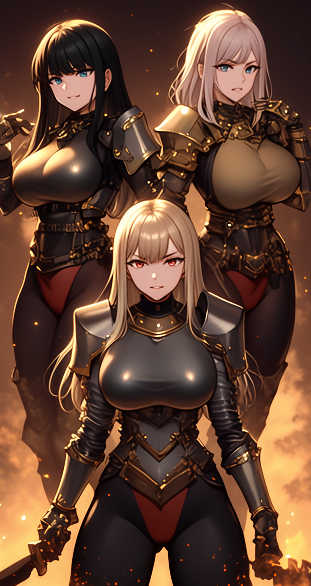 | <pre style="width: 400px; overflow-x: auto; white-space: nowrap;"><code>"wd_tagger": "breasts, multiple girls, 3girls, large breasts, armor, weapon, long hair, black hair, blue eyes, holding, shoulder armor, sword, looking at viewer, holding weapon, gauntlets, red eyes, holding sword, parted lips, blonde hair, grey hair, leotard, embers, pauldrons, white hair, belt, standing, boots",<br>"joy_tag": "long_hair, breasts, looking_at_viewer, smile, bangs, blue_eyes, multiple_girls, blonde_hair, large_breasts, black_hair, eyebrows_visible_through_hair, red_eyes, original, holding, standing, weapon, sidelocks, parted_lips, sword, 3girls, armor, holding_weapon, leotard, bodysuit, covered_navel, holding_sword, gauntlets, shoulder_armor, pauldrons, breastplate, embers",<br>"llama_joycaption_alphatwo": "This is a digitally rendered anime-style drawing featuring three imposing female warriors clad in intricately designed medieval fantasy armor. The central figure is a blonde woman, likely the protagonist, wearing a breastplate that accentuates her ample bust. Her expression is determined, and her eyes are a striking yellow, matching the armor's highlights. She wields a sword with both hands.The other two figures flank her, both with long, flowing dark hair (black for the one on the left and grey for the one on the right), and their armor mirrors the blonde's design but is slightly more elaborate.The armor is plated with metallic hues of gold, silver, and black, creating a dazzling, reflective surface. Their outfits feature high-neck collars leading to helmets with full-face visors tucked behind, highlighting their strong jawlines. The red accents under the breastplates hint at the strength and bloodlust within.The background is aflame with fiery tones of orange and red, enhancing the sense of battle readiness. Sparks of fire and molten rock rise around them, suggesting an infernal landscape. Each character's posture and expressions suggest they are ready to face whatever peril approaches, blending strength and authority.",<br>"llava_next": "The image depicts three animated characters, each with a unique design and style. They are dressed in armor and appear to be warriors or characters from a fantasy setting. The character in the foreground is holding a weapon, suggesting she is ready for battle or combat. The characters have distinct features, such as hair color and armor design, which might indicate they are from different factions or have different roles within a story or game. The background has a dramatic effect with warm, glowing elements that could represent fire or magical energy.",</code></pre> |
| 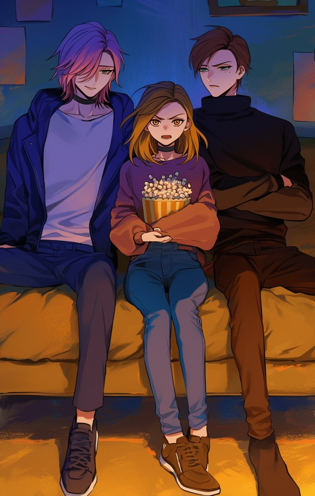 | <pre style="width: 400px; overflow-x: auto; white-space: nowrap;"><code>"wd_tagger": "popcorn, multiple boys, pants, 2boys, crossed arms, sitting, multicolored hair, food, choker, hair over one eye, shirt, 1girl, brown hair, green eyes, jacket, denim, shoes, sweater, turtleneck, black choker, brown footwear, indoors, medium hair, long sleeves, jeans, couch, purple hair, brown pants, open mouth, white shirt, black pants, blonde hair, yellow eyes, hood, short hair, blue jacket, looking at viewer, two-tone hair, black sweater, sneakers, black footwear, holding, black shirt, closed mouth, full body, blue pants",<br>"joy_tag": "1girl, long_hair, looking_at_viewer, smile, short_hair, open_mouth, blue_eyes, brown_hair, shirt, long_sleeves, brown_eyes, holding, sitting, jewelry, green_eyes, jacket, yellow_eyes, white_shirt, earrings, food, multiple_boys, multicolored_hair, shoes, choker, pants, 2boys, hood, indoors, hair_over_one_eye, medium_hair, black_footwear, sweater, hoodie, siblings, turtleneck, crossed_arms, brown_footwear, black_choker, denim, black_pants, sneakers, couch, jeans, turtleneck_sweater, blue_pants, black_sweater, blue_sweater",<br>"llama_joycaption_alphatwo": "The image is a digital drawing in an anime style, showcasing three characters, two males, and one female, sitting on a mustard-yellow couch. The setting appears informal and cozy, suggesting a casual living room. The light source comes from the right, casting gentle shadows and giving the scene depth.The female character in the center has shoulder-length, straight brown hair with lighter highlights, and she wears a purple sweatshirt adorned with a cartoon character illustration and blue skinny jeans. Her expression is mild and introspective as she holds a large bowl of popcorn.To her right is a male with long, lavender hair and a slender physique. He is dressed in a casual yet chic look, combining a dark blue blazer over a light purple shirt and gray pants, his shoes being dark and polished.On her left is another male, with short, dark brown hair groomed neatly, and a more muscular build. He sports a black turtleneck sweater and tailored brown trousers, and his neutral, almost stern expression contrasts with the relaxed atmosphere.The background comprises simple beige and blue-toned wall panels that don’t draw attention from the subjects. Overall, the image captures a moment of shared, relaxed leisure among the characters.",<br>"llava_next": "The image depicts three animated characters sitting on a couch. The character in the middle is holding a bucket of popcorn, suggesting they are watching something together, possibly a movie or a TV show. The characters are drawn in a style that is reminiscent of anime or manga, with detailed features and vibrant colors. The setting appears to be a cozy indoor space, possibly a living room, with a warm and inviting atmosphere.",</code></pre> |
| 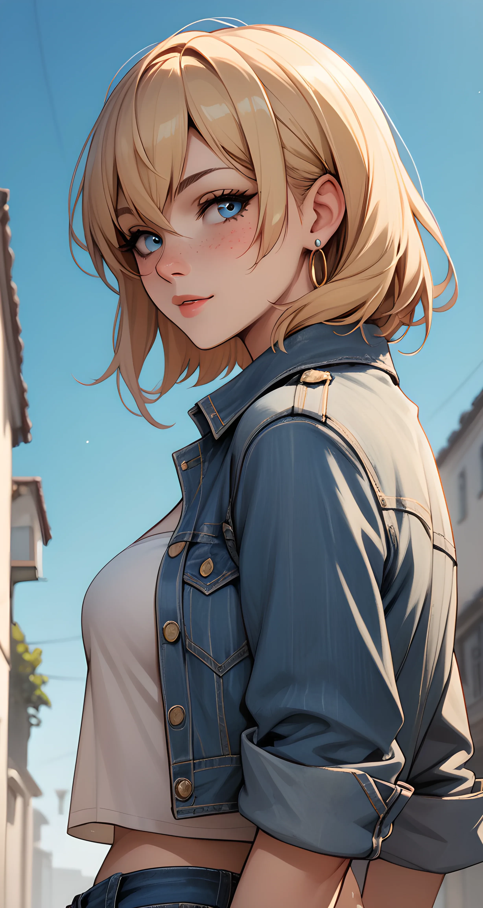 | <pre style="width: 400px; overflow-x: auto; white-space: nowrap;"><code>"wd_tagger": "1girl, solo, blue eyes, blonde hair, denim, jewelry, earrings, looking at viewer, freckles, jacket, outdoors, short hair, mole under eye, mole, breasts, upper body, denim jacket, from side, white shirt, shirt, parted lips, sky, day, lips, medium breasts, blue sky, hoop earrings, blush, jeans, pants, blue jacket, hair between eyes, smile, crop top",<br>"joy_tag": "1girl, solo, breasts, blush, looking_at_viewer, smile, short_hair, bangs, blue_eyes, blonde_hair, shirt, original, medium_breasts, hair_between_eyes, jewelry, closed_mouth, jacket, upper_body, white_shirt, earrings, sky, open_clothes, outdoors, day, midriff, pants, lips, from_side, blue_sky, open_jacket, looking_to_the_side, crop_top, denim, building, blue_jacket, freckles, denim_shorts, cropped_jacket, jeans, hoop_earrings",<br>"llama_joycaption_alphatwo": "This image is a digital illustration in a highly detailed, realistic anime style. The subject is a young woman with pale skin and striking blue eyes. Her delicate, yet determined facial expression shows faint blush marks and slightly parted lips. She has short, blonde hair styled in a voluminous bob with soft layers, parted slightly off-center.The woman is dressed casually but stylishly, with an unbuttoned blue denim jacket, revealing a white crop top that accentuates her slim waist and moderately sized bust. The denim jacket shows the texture of well-worn fabric, with visible stitching and seams that give a slightly rugged look. Large, gold hoop earrings provide a sharp contrast to her light attire, lending an additional touch of individuality.The background is an urban setting with a bright blue sky and soft, warm lighting. The street is narrow and lined with buildings featuring pastel tones, with the focus on the perspective that it appears to be early morning or late afternoon. The combination of the vivid colors and meticulous detail makes the scene feel lively and immersive, effectively drawing the viewer into the character's world.",<br>"llava_next": "The image shows an animated character, a young woman with blonde hair and blue eyes. She is wearing a denim jacket over a white top, and she has a pair of earrings. The character is depicted in a stylized manner, typical of anime or manga art, with a focus on her facial features and attire. The background suggests an outdoor setting with buildings and a clear sky, indicating a sunny day.",</code></pre> |
| 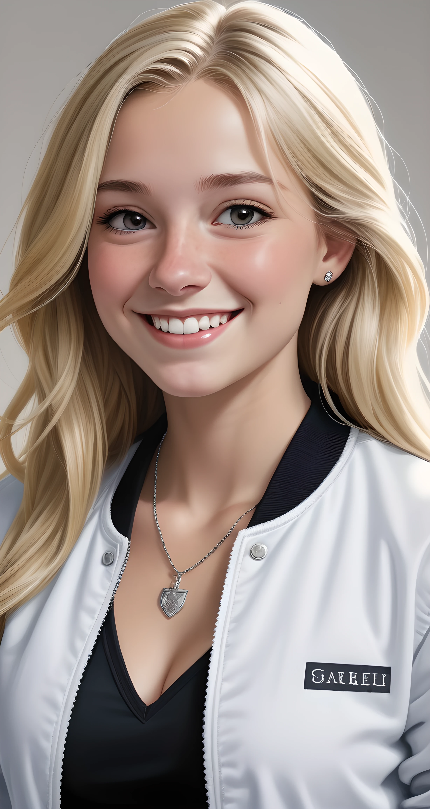 | <pre style="width: 400px; overflow-x: auto; white-space: nowrap;"><code>"wd_tagger": "1girl, jewelry, solo, breasts, blonde hair, necklace, long hair, cleavage, smile, jacket, earrings, realistic, teeth, looking at viewer, upper body, white jacket, black shirt, artist name, open jacket, grin, medium breasts, shirt, lips, open clothes, grey background, nose, freckles, mole",<br>"joy_tag": "1girl, solo, long_hair, breasts, looking_at_viewer, smile, blonde_hair, photoshop_(medium), shirt, original, cleavage, medium_breasts, jewelry, collarbone, jacket, upper_body, heart, earrings, open_clothes, teeth, artist_name, necklace, grey_background, grin, mole, lips, open_jacket, grey_eyes, parted_bangs, black_shirt, white_jacket, forehead, realistic, nose, photo-referenced",<br>"llama_joycaption_alphatwo": "The image is a highly detailed, realistic digital rendering of a young woman. She is depicted from the shoulders up in a three-quarter view, facing the camera with a bright, warm smile. The woman has long, wavy, platinum blonde hair that cascades past her shoulders. Her skin is fair with a natural, radiant glow. She is wearing a white, unzipped bomber jacket with the name "CAECELLI" stitched in bold black letters on the upper right chest area. Underneath the jacket, she has on a black V-neck top, visible as the jacket is open. Around her neck hangs a delicate silver necklace with a heart-shaped pendant. On her left ear, she wears a small, sparkling diamond stud earring, adding a touch of elegance. The background of the image is a simple gradient of light gray, subtly blending to white, which accentuates and highlights the detailed textures and colors of her attire and skin. The lighting is soft and balanced, effectively emphasizing her facial features and the plushness of her hair. This realistic digital artwork captures a vibrant, youthful appearance with clean lines and meticulous attention to detail.",<br>"llava_next": "The image shows a digital illustration of a woman with blonde hair, smiling at the camera. She is wearing a white jacket with a black collar and a black top underneath. On her necklace, there is a silver pendant with a heart shape. The background is neutral, which puts the focus on her. The image appears to be a stylized portrait, possibly for a character or a model, given the polished and professional look.",</code></pre> |
| 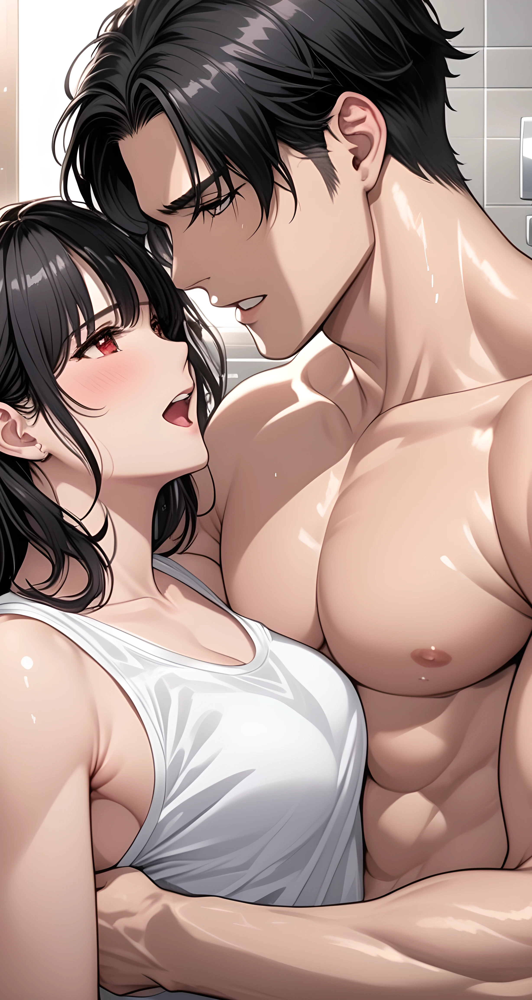 | <pre style="width: 400px; overflow-x: auto; white-space: nowrap;"><code>"wd_tagger": "1girl, 1boy, black hair, breasts, red eyes, looking at another, muscular, white tank top, open mouth, tank top, short hair, blush, muscular male, hetero, teeth, pectorals, eye contact, upper body, collarbone, indoors, large breasts, nipples, tiles, tile wall, bare shoulders, cleavage, abs",<br>"joy_tag": "1girl, long_hair, breasts, blush, smile, short_hair, open_mouth, bangs, large_breasts, black_hair, red_eyes, 1boy, original, bare_shoulders, jewelry, nipples, collarbone, upper_body, sweat, hetero, parted_lips, teeth, indoors, medium_hair, mole, looking_at_another, siblings, muscular, abs, tank_top, piercing, tan, pectorals, muscular_male, eye_contact, brother_and_sister, white_tank_top, tile_wall",<br>"llama_joycaption_alphatwo": "This image is a digital anime-style illustration showcasing a romantic, intimate moment between two individuals, a man and a woman. The man, who appears to be in his early twenties, stands to the right, with heavily shaded, muscular arms and broad shoulders glistening with sweat. His hair is styled in a stylish side-parted look, and his expression is intense as he looks downward, with his hot breath caressing the woman's face. His deep-set eyes are an arresting feature, suggesting intensity.The woman, also in her early twenties, has fair skin with a slight blush on her cheeks and closed eyes. Her hair is medium-length, a glossy ash-black color, and she has prominent side-swept bangs framing her face. She is wearing a white, wet tank top, clinging closely to her medium-sized breasts, suggesting she has been engaged in rigorous physical activity or is simply drenched with sweat. The background is a blurred mix of neutral colors, possibly indicating an outdoor or indoor setting filled with a warm, soft light that gives the scene a glow. Small details like droplets of sweat give the characters a realistic, hot summer day atmosphere. The close-up framing ensures focus remains on the intimate connection and physical allure of the characters.",<br>"llava_next": "The image depicts two animated characters in a close, intimate pose. The character on the left appears to be a female with dark hair and a white top, and the character on the right appears to be a male with dark hair and a bare chest. They are in a room with a tiled wall and a window in the background, and the lighting suggests it might be daytime. The characters are drawn in a style that is typical of Japanese anime or manga.",</code></pre> |
| 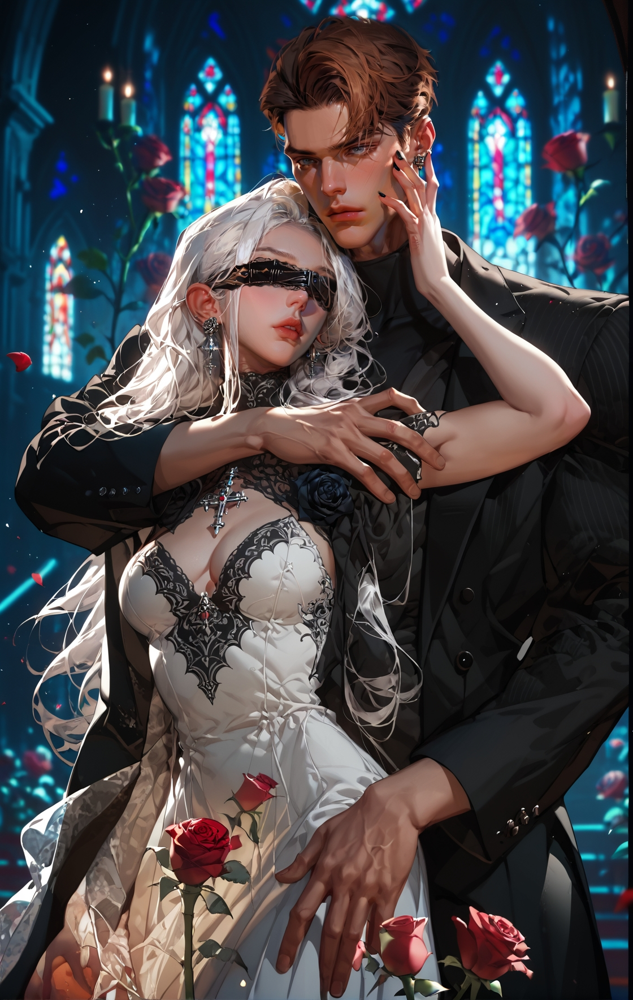 | <pre style="width: 400px; overflow-x: auto; white-space: nowrap;"><code>"wd_tagger": "1girl, 1boy, breasts, dress, flower, white dress, blindfold, jewelry, long hair, brown hair, rose, white hair, earrings, cleavage, hetero, parted lips, stained glass, red flower, jacket, medium breasts, blue eyes, veins, red rose, petals, indoors, black jacket, short hair, blurry, candle",<br>"joy_tag": "1girl, long_hair, breasts, brown_hair, large_breasts, photoshop_(medium), shirt, dress, 1boy, long_sleeves, original, brown_eyes, cleavage, medium_breasts, jewelry, closed_mouth, jacket, flower, cowboy_shot, earrings, white_hair, hetero, parted_lips, open_clothes, striped, artist_name, collared_shirt, indoors, necklace, white_dress, nail_polish, looking_at_another, blurry, lips, fingernails, petals, hug, black_jacket, parted_bangs, black_shirt, rose, depth_of_field, facial_hair, turtleneck, wavy_hair, blurry_background, formal, cleavage_cutout, couple, cross, crying, ring, suit, black_pants, beard, hug_from_behind, wedding_dress, nose, blindfold, candle, hand_on_another's_face, manly, covered_eyes, pinstripe_pattern, hand_on_another's_cheek, black_suit, stained_glass, arm_around_waist, tuxedo, church",<br>"llama_joycaption_alphatwo": "This image is a digital illustration, executed in a highly detailed, semi-realistic style with a dark fantasy theme. It features two characters standing closely together, set against an ornate Gothic cathedral backdrop. The cathedral's stained glass windows glow with multi-colored hues, primarily blues, reds, and purples.The female character, positioned on the left, has long, flowing white hair styled in loose waves. She wears a revealing, white lace wedding gown with a black lace overlay, showcasing ample cleavage and intricate lacework that highlights her voluptuous physique. A black masquerade veil covers her eyes, adding a mystical touch to her appearance. Her skin is alabaster, and her lips are painted a bold red.The male character, on the right, has an athletic build and short, styled dark brown hair. He is dressed in a black pinstripe suit, adding a stark contrast to the white dress of the woman. His left hand rests possessively on the woman's shoulder while his right hand gently cradles her neck, his fingers intertwined with hers.In the foreground, scattered rose petals float around the couple, adding a sense of movement and romance to the scene. The overall tone is dark yet intimate, blending elements of eroticism and fantasy seamlessly.",<br>"llava_next": "The image depicts an illustrated scene featuring two characters in a gothic or fantasy setting. The character on the left appears to be a female with pale skin, white hair, and a white dress with a black lace overlay. She is wearing a blindfold and has a cross necklace. The character on the right appears to be a male with dark hair, a black suit, and a red rose in his lapel. Both characters have a somewhat somber or mysterious expression, and the background suggests a cathedral or church with stained glass windows and candles, which adds to the gothic atmosphere. The overall style of the image is detailed and evocative, with a focus on the characters and their attire.",</code></pre> |
| 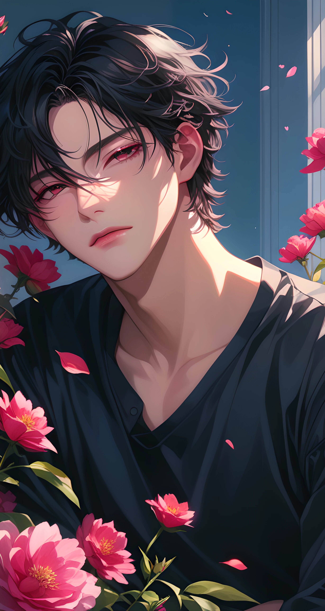 | <pre style="width: 400px; overflow-x: auto; white-space: nowrap;"><code>"wd_tagger": "1boy, flower, male focus, solo, black hair, shirt, black shirt, looking at viewer, short hair, pink flower, petals, red eyes, upper body, closed mouth, collarbone, indoors, hair between eyes, bishounen, lips",<br>"joy_tag": "solo, looking_at_viewer, short_hair, bangs, black_hair, red_eyes, shirt, 1boy, long_sleeves, original, hair_between_eyes, closed_mouth, collarbone, flower, upper_body, male_focus, indoors, lips, petals, parted_bangs, black_shirt, expressionless, half-closed_eyes, red_flower, pink_flower, holding_flower, bishounen, falling_petals",<br>"llama_joycaption_alphatwo": "This is a digital artwork styled in a highly detailed and expressive anime influence. The subject is a young man with delicate, feminine features and smooth, fair skin glowing under a soft light from a nearby window. His gaze is directed forward with a serene, introspective expression. He has long, wavy black hair that frames his face and casts gentle shadows that accentuate his high cheekbones and pronounced jawline. His pinkish-purple eyes are striking, adding a soft contrast against his dark eyebrows.He is wearing a simple black t-shirt that clings to his slender yet athletic physique. The background features a wall painted in various shades of blue, illuminated by sunlight that appears to be coming from an unseen window to the right. Interspersed around the edges of the image are pink peonies in full bloom, their petals softly out of focus, suggesting gentle movement as if they are floating around him.The lighting in the image is meticulously crafted, creating a balanced mix of natural light that emphasizes the subject's face and the nearby flowers. This image conveys a peaceful, almost ethereal atmosphere, capturing a moment of quiet contemplation in a serene indoor setting.",<br>"llava_next": "The image shows an illustrated character with dark hair and red eyes. The character is wearing a black top and is surrounded by pink flowers, which are falling around them. The background is a soft, gradient blue, and there's a window with sunlight coming through, casting a warm glow on the scene. The overall aesthetic is quite artistic and could be associated with anime or manga-style illustrations.",</code></pre> |
| 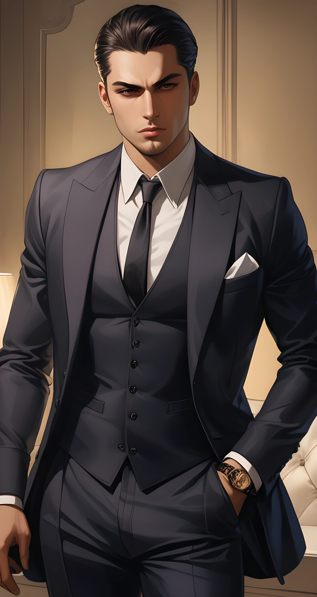 | <pre style="width: 400px; overflow-x: auto; white-space: nowrap;"><code>"wd_tagger": "1boy, male focus, solo, watch, necktie, wristwatch, formal, shirt, suit, hand in pocket, black hair, jacket, white shirt, black pants, pants, vest, short hair, black jacket, looking at viewer, black vest, collared shirt, black suit, black necktie, facial hair, closed mouth, open clothes, indoors, open jacket",<br>"joy_tag": "solo, looking_at_viewer, short_hair, black_hair, shirt, 1boy, original, brown_eyes, closed_mouth, standing, jacket, white_shirt, male_focus, cowboy_shot, necktie, pants, collared_shirt, indoors, black_eyes, vest, black_jacket, facial_hair, formal, suit, black_pants, black_necktie, watch, hand_in_pocket, sideburns, stubble, black_vest, wristwatch, hair_slicked_back, black_suit",<br>"llama_joycaption_alphatwo": "This is a highly detailed digital illustration rendered in a realistic art style. The subject is a handsome young man in his early 30s with a strong jawline and a well-groomed beard, giving him a sophisticated appearance. His skin tone is light, and his facial expression is intense and serious. He has jet-black hair slicked back, adding to his polished look. He is dressed in a tailored charcoal-gray three-piece suit made of what appears to be a matte, high-quality fabric, indicating he is quite well-dressed. The suit includes a sharp vest and pants, with the jacket left open to reveal his well-fitted white dress shirt underneath. A black tie is neatly tied, and a single white pocket square is peeking out from his right breast pocket. The man exudes confidence with a relaxed, yet assertive posture as he stands in what is clearly a richly decorated room. An ornate wooden panel behind him sets the luxurious atmosphere of the space. Additionally, the soft, warm lighting casts subtle shadows, enhancing his muscular build, particularly the definition of his chest and arms. His left wrist features a modern gold watch, adding an accessory that complements his ensemble. The overall design of the image radiates wealth and power.",<br>"llava_next": "The image shows an illustrated character, a man dressed in a formal suit with a tie, a white shirt, and a pocket square. He has a serious expression on his face and is looking directly at the viewer. The character is depicted with a stylized, detailed art style, which suggests that this could be from a graphic novel, comic book, or a similar medium. The background is minimalistic, with warm tones that give the image a sophisticated feel.",</code></pre> |
